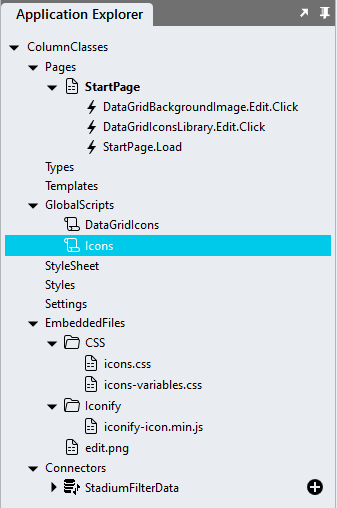

# DataGrid Icons Property

Since Stadium 6.8.3 we can use the column classes property to easily display icons in DataGrid columns. 

https://github.com/stadium-software/datagrid-icons-property/assets/2085324/14c42cd9-1d6c-4822-8c3f-91c7f51d217b

## Version
1.0 initial release

# Setup

## Application Setup
1. Check the Enable Style Sheet checkbox in the application properties

## DataGrid Setup

1. Add a Connector, a DataGrid and populate the DataGrid with data as per usual (if you are not sure how, use [this](https://github.com/stadium-software/samples-database))
2. Open the DataGrid "Columns" property
3. Select a column with a "Click" event (like "Edit" or "Delete") and locate the "Classes" property

## Displaying the icon as a background image

1. Add a class of your choice to the selected column "Classes" property (e.g. edit-image)
2. Find an icon file
3. Drag it into the "EmbeddedFiles" folder
4. Open the _Stylesheet_ in the Stadium Application Explorer
5. Paste the CSS below into the Stylesheet. **NOTE:** The CSS below assumes the image name is "edit.png"

```css
td.edit-image > *,
td.edit-image:hover > * {
    background-image: url('/src/assets/EmbeddedFiles/edit.png');
    background-repeat: no-repeat;
    background-size: 20px;
    background-position: center;
    height: 20px;
    width: 30px;
    font-size: 0;
}
```

## Displaying an icon from the Iconify icons library

To display icons using the Icons library, the [Icons Module](https://github.com/stadium-software/icons) must be implemented in the application



1. Add the class 'stadium-icon' to the column "Classes" property
2. Find a symbol you wish to display: see [finding and icon](https://github.com/stadium-software/icons?tab=readme-ov-file#finding-an-icon)
3. Add the name of the symbol to the control classes property (e.g. 'material-symbols:edit' or 'material-symbols:delete')

*Example*
```
stadium-icon material-symbols:edit
```

## Hiding the icon in the column header
1. Add the CSS below to the Stylesheet

```css
th.stadium-icon > * {
	position: absolute;
	width: 1px;
	height: 1px;
	margin: -1px;
	border: 0;
	padding: 0;
	white-space: nowrap;
	clip-path: inset(100%);
	clip: rect(0 0 0 0);
	overflow: hidden;
}
```

## Icon Styles

Additional classes can be added to the control classes property to manipulate the icon

1. Size
   1. The default icon size is 24px x 24px
   2. *icon-size-xx* allows you to define a custom icon size in pixels (e.g. icon-size-12 for 12px by 12px or icon-size-40 for 40px by 40px)
2. Color
   1. The default icon color is inherited by the page
   2. *icon-color-######* allows you to define a custom icon color in hex (e.g. icon-color-#FFFF00, icon-color-ccc or icon-color-red)

*Example*
```
stadium-icon material-symbols:edit icon-size-24 icon-color-eeeeee
```
